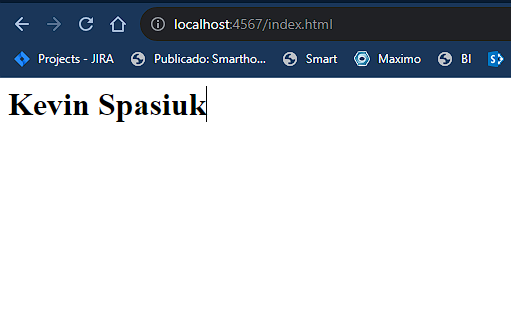

# Taller Docker

Resolución del ejercicio 01 de taller docker 2023

## Consigna

1. Crea una página html que tenga tu nombre
2. Ejecuta una imagen nginx (https://hub.docker.com/_/nginx) para que sirva tu página. Para esto tendrás que utilizar el comando docker run y deberás investigar la documentación de la imagen nginx para descubrir cómo especificarle el contenido que el servidor debe servir.

## Resolución

```bash
docker run --name ejercicio01 -p 4567:80 -v C:\Users\kevin\Documentos\tallerDocker\ejercicio01:/usr/share/nginx/html:ro -d nginx
```

Tuve que usarlo en powershell por problemas en levantar el volumen.

Comando -p: bindeo el puerto 80 de nginx al 4567 de mi máquina local. Luego fui a http://localhost:4567/index.html para ver el archivo html creado.

