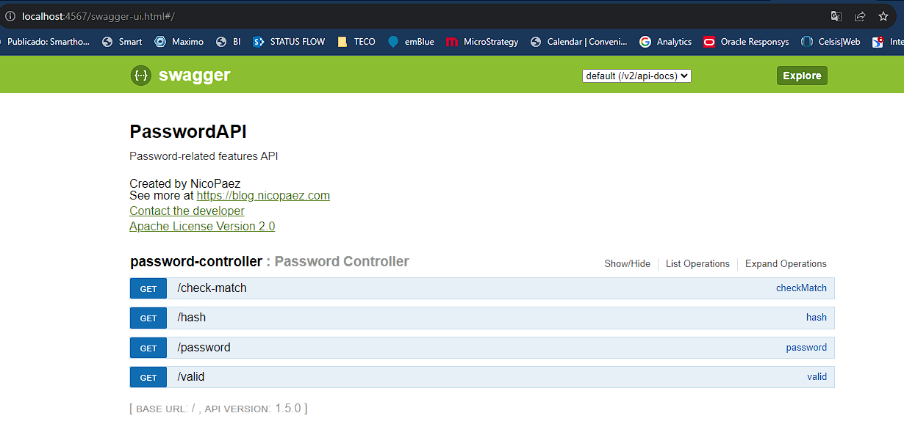

# Taller Docker ej04

Resolución del ejercicio 04 de taller docker 2023

## Consigna

1. Escribir un dockerfile
2. Generar la imagen a partir del dockerfile ejecutando un docker build
3. Publicar la imagen en Dockerhub


## Resolución

1. Se descargó el .jar en una carpeta /ejercicio04
2. Se creo el Dockerfile en la misma carpeta 

```Dockerfile
#version de java usada
FROM openjdk:11-jre-slim
#se copia el jar local al container
COPY passwordapi.jar /app/passwordapi.jar
#se establece el workdir
WORKDIR /app
#se corre el comando para iniciar el programa java
CMD ["java", "-jar", "passwordapi.jar"]
```
3. Se buildeó la imagen

```bash
$ docker build -t kevinspasiuk/tallerdocker-ej04 .

$ docker image ls
REPOSITORY                              TAG            IMAGE ID       CREATED         SIZE
kevinspasiuk/tallerdocker-ej04          latest         b69834a5a7df   8 seconds ago   249MB
nicopaez/passwordapi-java               java8-fabric   c479d0765f34   4 years ago     130MB
nicopaez/passwordapi-java               java8-alpine   22e1f6ea60af   4 years ago     108MB
```

4. Se corrió la imagen

```bash
$ docker run -p 4567:8080 kevinspasiuk/tallerdocker-ej04
```


5.  Se subió la imagen a docker hub 

```bash
$ docker image push kevinspasiuk/tallerdocker-ej04:latest
```

https://hub.docker.com/repository/docker/kevinspasiuk/tallerdocker-ej04/general
