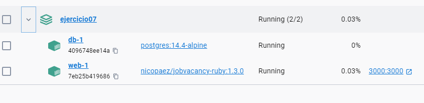

# Taller Docker ej07

Resolución del ejercicio 07 de taller docker 2023

## Consigna

Para este ejercicio necesitas docker-compose, si estas usando Docker Desktop ya lo tienes instalado, sino deberás instalarlo aparte.Crea un archivo llamado "docker-compose.yml" y pon dentro el contenido de este link: https://gitlab.com/-/snippets/2376003/raw/main/docker-compose.yml.
A continuación ejecuta este comando en una terminal: docker-compose up.
Espera unos minutos hasta que dejen de aparecer mensaje en la terminal. Luego navega localhost:3000 para verificar que la aplicación levantó correctamente.


## Resolución

1. Se creó .yaml

2. ¿Cuántos contenedores se están ejecutando? (pueden verlo en el archivo docker-compose.yml y también ejecutando docker ps)

    Están corriendo 2 contenedores, también se puede observar en docker desktop:

    

3. ¿Cuales son las imágenes en las que están basados los mencionados contenedores? 

    El contenedor web está basado en la imágen nicopaez/jobvacancy-ruby:1.3.0
    Y el contenedor de la DB es un postgres:14.4-alpine

4. ¿Puedes leer el docker-compose.yml y describir lo que hace cada una de sus lineas? 

    ``` yml
    version: '2' 
    ```
    Hace referencia a que versión de sintaxis se va a utilizar.

    ``` yml
    services: 
    ```
    Declara los servicios que se van a utilizar.

    ``` yml
      web:
        image: nicopaez/jobvacancy-ruby:1.3.0
        links:
        - db
        ports:
        - "3000:3000"
        environment:
        PORT: "3000"
        RACK_ENV: "production"
        DATABASE_URL: "postgres://postgres:Passw0rd!@db:5432/postgres"
        depends_on:
        - db
    ```
    - links: genera una conexión al servicio especificado a través de un alias.
    - ports: linkea puerto de host a puerto contenedor docker.
    - depends_on: en este ejemplo indica que el serivico web depende de la DB y se debe correr cuando una vez que haya terminado el set up de la DB.

5. Dado que cada contenedor corre en forma aislada ¿Cómo es posible que esos contenedores se vean entre sí?

    Como mencioné en el punto anterior, es con el comando links que permiten que un contenedor pueda ver el otro. 