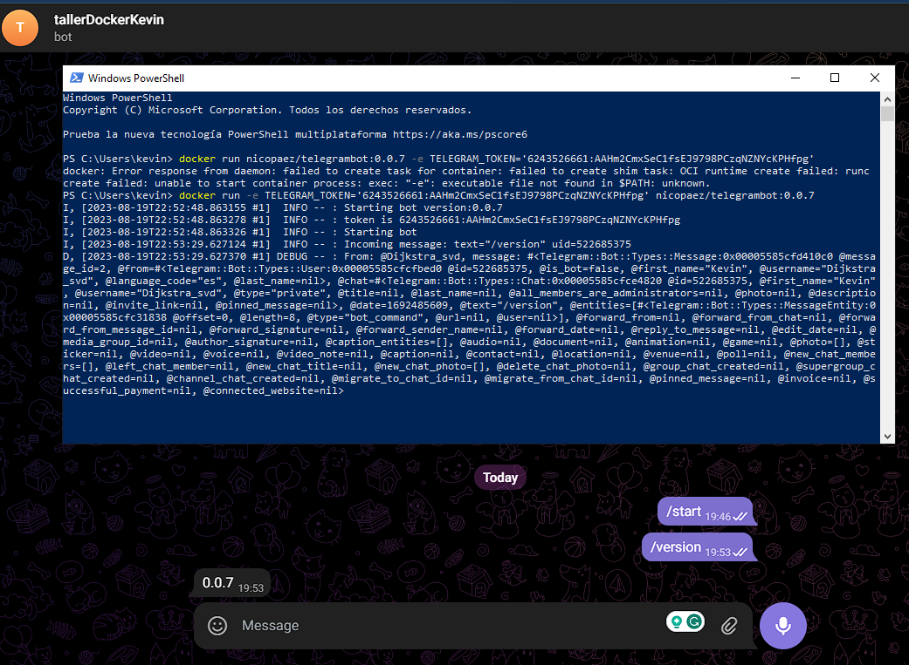

# Taller Docker ej11

Resolución del ejercicio 11 de taller docker 2023

## Consigna

Desplegar en kubernetes un bot de telegram.

En primer lugar tienes que crear un bot a partir de:

1. Ir a https://web.telegram.org/#/im?p=@BotFather y seguir los pasos
2. Enviar el comando /newbot
3. Seguir los pasos y al final el BotFather responde con un token, tomar nota del token

Luego puedes utilizar esta imagen que ya tiene un bot listo con algunas funcionalidades básicas (nicopaez/telegrambot:0.0.7).
Para correr esa imagen necesitas darle una variable de ambiente TELEGRAM_TOKEN con el correspondiente valor del token que obtuviste previamente.

Primero asegurate de poner a correr el bot localmente con docker run y pasandole como variable de ambiente el TELEGRAM_TOKEN.
En telegram agrega el bot como contacto y chateale "/version". Deberá contestar con la versión.


Una vez que esto corra, entonces escribe el correspondiente descriptor de pod para desplegar el bot en kubernetes/okteto.
Pista: puedes definir la variable de ambiente del token como parte del pod.yaml (https://kubernetes.io/docs/tasks/inject-data-application/define-environment-variable-container/).

Finalmente, entrega el link a tu repositorio (ejercicio10) incluyendo:
un screenshot de un chat con el bot que muestre la versión
el pod.yml (no pongas el valor de token en el repo, simplemente deja "A COMPLETAR" )
las instrucciones detalladas que seguiste

## Resolución

Primero se corrió el bot de manera local:
```bash
docker run nicopaez/telegrambot:0.0.7 -e TELEGRAM_TOKEN='{TOKEN}'
```

Captura del bot corriendo localmente:


Se creó el siguiente descriptor del pod:

```yaml
apiVersion: v1
kind: Pod
metadata:
  name:  telegrambot-pod
spec:
  containers:
  - name: telegrambot-container
    image: nicopaez/telegrambot:0.0.7
    env:
    - name: TELEGRAM_TOKEN
      value: "{TOKEN}"
```

Y por último se lo aplicó:

```bash
kubectl apply -f ./pod.yaml
```

Captura del bot corriendo en Okteto:
